# Secure Twitter-like Application (Monolith + Serverless Migration)

This repository contains the full assignment implementation for building a secure Twitter-like application that starts as a Spring Boot monolith and evolves into AWS Lambda microservices, using Auth0 as the identity and authorization provider.

## Project Description

The application allows users to:

- Log in and log out with Auth0.
- Create short posts (maximum 140 characters).
- View a single global public stream/feed.
- Retrieve current authenticated user profile through `/api/me`.

Security and documentation are first-class requirements:

- Auth0-protected backend using JWT access tokens.
- Public and protected endpoint separation.
- Scope-based authorization (`read:posts`, `write:posts`, `read:profile`).
- Swagger/OpenAPI documentation for the monolith.

## Architecture Evolution

## 1) Monolith Phase

- `Spring Boot` backend (`src/main/java/...`)
- `React` frontend (`frontend/`)
- `Auth0` for authentication and authorization

## 2) Serverless Microservices Phase

- `API Gateway (HTTP API)`
- `AWS Lambda` functions:
  - `posts-service`
  - `stream-service`
  - `user-service`
- `DynamoDB` table for posts storage
- Shared JWT verification module in `microservices/shared/auth.js`

## Architecture Diagram

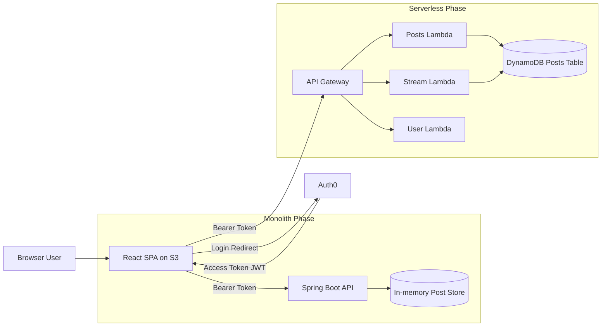

## Repository Structure

```text
.
├── src/
│   ├── main/
│   │   ├── java/or/edu/escuelaing/daniel/twitter/
│   │   └── resources/application.yml
│   └── test/
├── frontend/
│   ├── src/
│   ├── package.json
│   └── .env.example
├── microservices/
│   ├── posts-service/
│   ├── stream-service/
│   ├── user-service/
│   ├── shared/
│   ├── package.json
│   └── template.yaml
├── pom.xml
└── README.md
```

## Auth0 Setup

Create the following in Auth0:

1. **API**
   - Name: `tdse-twitter-api`
   - Identifier (Audience): for example `https://api.example.com/twitter`
   - Signing Algorithm: `RS256`

2. **SPA Application**
   - Name: `tdse-twitter-frontend`
   - Allowed Callback URLs: `http://localhost:5173`
   - Allowed Logout URLs: `http://localhost:5173`
   - Allowed Web Origins: `http://localhost:5173`

3. **API Permissions (Scopes)**
   - `read:posts`
   - `write:posts`
   - `read:profile`

4. **Grant permissions to test users**
   - Assign scopes so authenticated users can call protected endpoints.

## Monolith Setup and Local Execution

## Prerequisites

- Java 21+
- Maven 3.9+
- Node.js 20+ (for frontend)

## Docker Setup (Backend + Frontend)

You can run the monolith backend and frontend together with Docker Compose.

1. Create local environment file:

```bash
cp .env.example .env
```

2. Edit `.env` with your Auth0 values:

- `AUTH0_ISSUER_URI`
- `AUTH0_AUDIENCE`
- `VITE_AUTH0_DOMAIN`
- `VITE_AUTH0_CLIENT_ID`
- `VITE_AUTH0_AUDIENCE`

3. Start all containers:

```bash
docker compose up --build
```

4. Open the applications:

- Frontend: `http://localhost:5173`
- Backend API: `http://localhost:8080`
- Swagger UI: `http://localhost:8080/swagger-ui/index.html`

5. Stop containers:

```bash
docker compose down
```

Notes:

- The frontend container is served with Nginx and built with Vite at image build time.
- The backend container runs the Spring Boot fat JAR.
- If you change frontend environment variables, rebuild with `docker compose up --build`.

## Backend Configuration

1. Copy environment template:

```bash
cp .env.example .env
```

2. Export required variables (or configure in your IDE):

```bash
export AUTH0_ISSUER_URI="https://YOUR-DOMAIN.auth0.com/"
export AUTH0_AUDIENCE="https://api.example.com/twitter"
export CORS_ALLOWED_ORIGINS="http://localhost:5173"
export PORT="8080"
```

3. Run the backend:

```bash
mvn spring-boot:run
```

## Swagger / OpenAPI

When the backend is running, open:

- `http://localhost:8080/swagger-ui/index.html`
- `http://localhost:8080/v3/api-docs`

## API Endpoints

| Method | Endpoint      | Access     | Scope Required |
|--------|---------------|------------|----------------|
| GET    | `/api/posts`  | Public     | None           |
| GET    | `/api/stream` | Public     | None           |
| POST   | `/api/posts`  | Protected  | `write:posts`  |
| GET    | `/api/me`     | Protected  | `read:profile` |

## Frontend Setup (React + Auth0)

1. Configure frontend environment:

```bash
cd frontend
cp .env.example .env
```

2. Set `.env` values:

```dotenv
VITE_AUTH0_DOMAIN=your-tenant.us.auth0.com
VITE_AUTH0_CLIENT_ID=your-spa-client-id
VITE_AUTH0_AUDIENCE=https://api.example.com/twitter
VITE_API_BASE_URL=http://localhost:8080
```

3. Install and run:

```bash
npm install
npm run dev
```

The app will be available at `http://localhost:5173`.

## Frontend Deployment to Amazon S3

1. Build the frontend:

```bash
cd frontend
npm run build
```

2. Create and configure S3 bucket for static website hosting:

```bash
aws s3 mb s3://YOUR_BUCKET_NAME --region YOUR_REGION
aws s3 website s3://YOUR_BUCKET_NAME/ --index-document index.html --error-document index.html
```

3. Upload built files:

```bash
aws s3 sync dist/ s3://YOUR_BUCKET_NAME --delete
```

4. Add bucket policy for public read (or serve privately through CloudFront + OAC).

## Microservices Migration (AWS Lambda)

The `microservices/` folder contains a serverless split into three services:

- `posts-service`: create and list posts
- `stream-service`: global stream endpoint
- `user-service`: current user profile endpoint (`/api/me`)

## Deploy with AWS SAM

## Steps before deploy

- Get ready Sam intalling this file from github:
- https://github.com/awslabs/aws-sam-cli/releases/latest
- AWS_SAM_CLI_64_PY3.msi
- Start the .msi file

## Configuration for AWS CLI
- We need to configure the aws key and token 
- 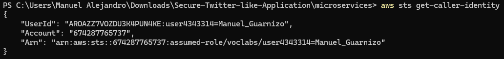

- We have to take into account the domain of auth0 tht we have
- 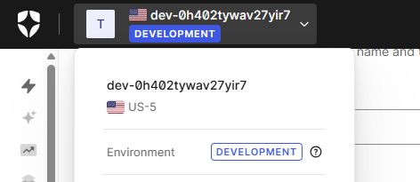

- Now let's start with the deploy with this comand in the microservices directory
- sam Deploy

- 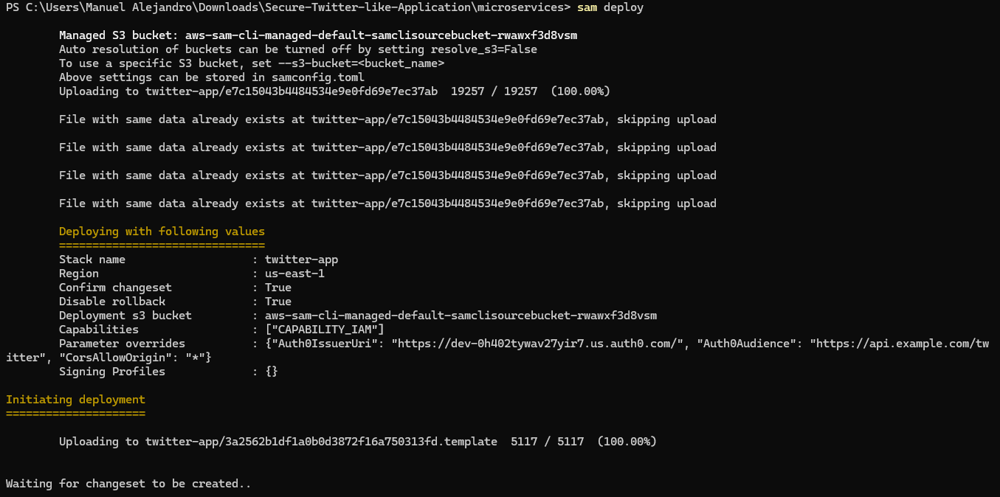
- 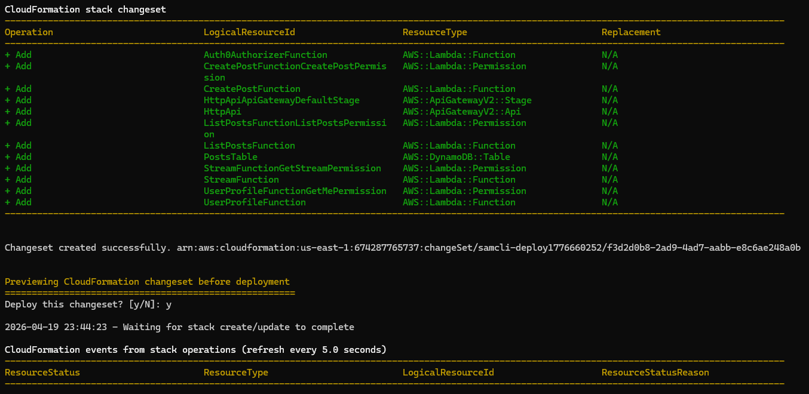
- 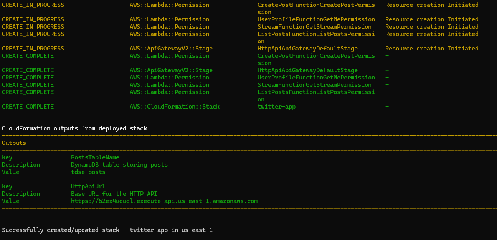
- 
- It already it's over and now we have to save this link that's the result of deploy:
- https://52ex4uquql.execute-api.us-east-1.amazonaws.com

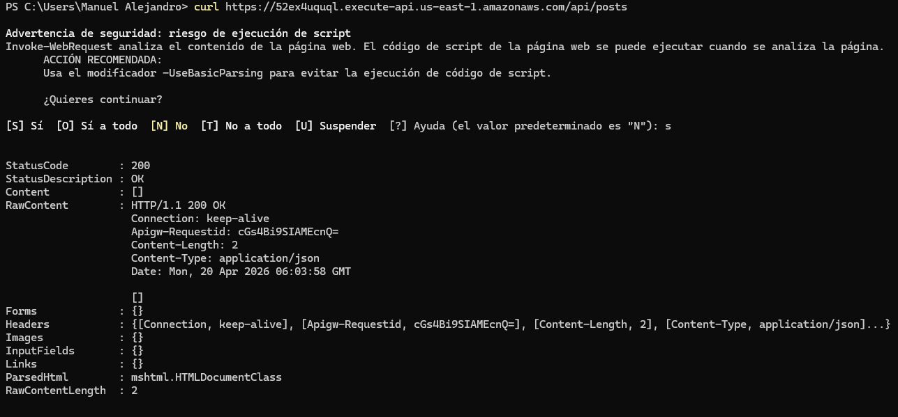

## Front S3 and as a AUTH0 CLient

- Before the front correct deploy we have to configure with the client of our AUTH0
- 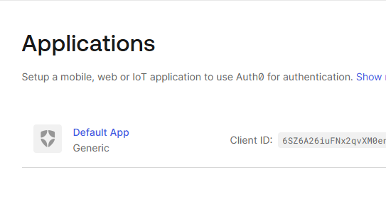

- We build with npm
- 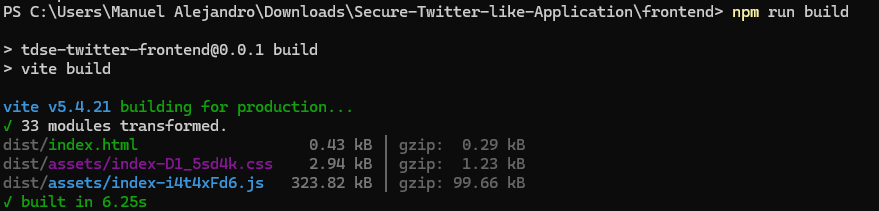

- We create and configure the S3
- 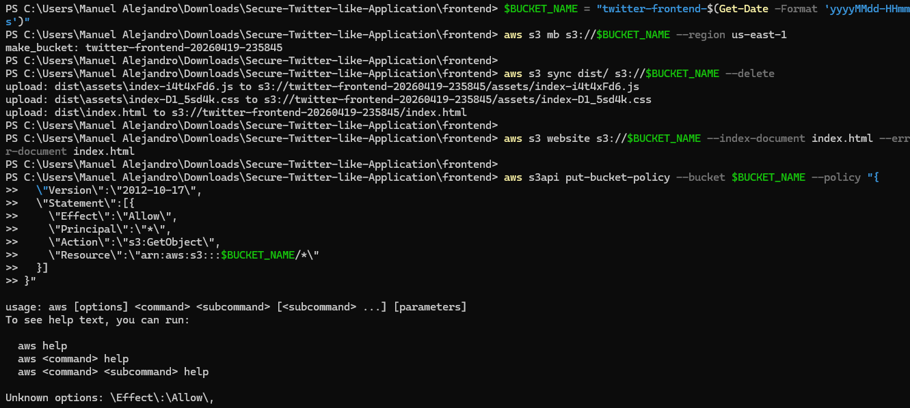

- We have to allow the front to callback
- 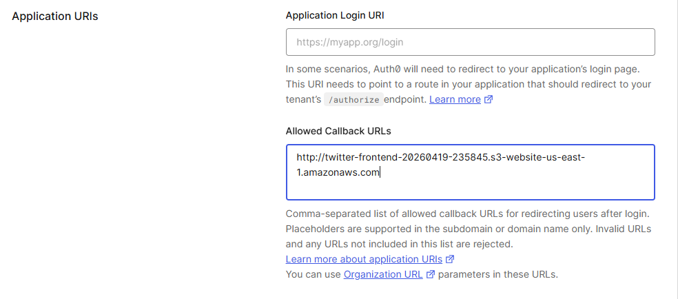

- Don't forget to configure the S3 permission
- 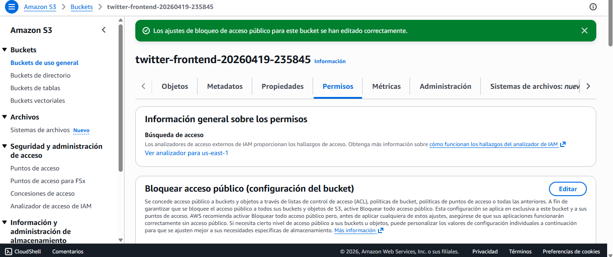
- 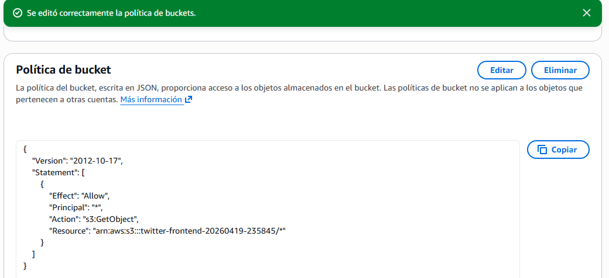


- Now we have to create the api before prove the front
- 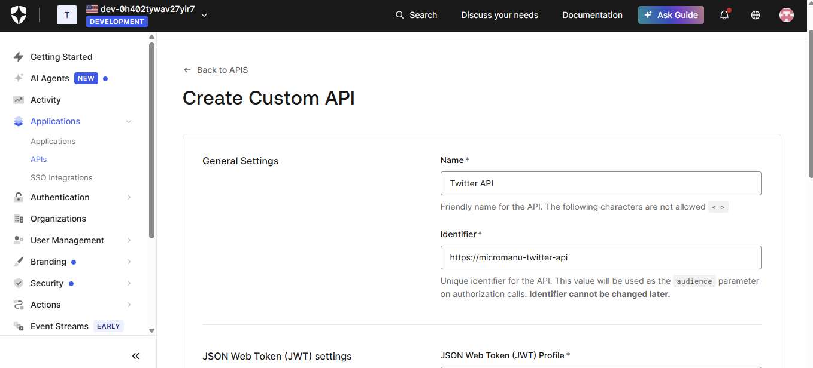
- 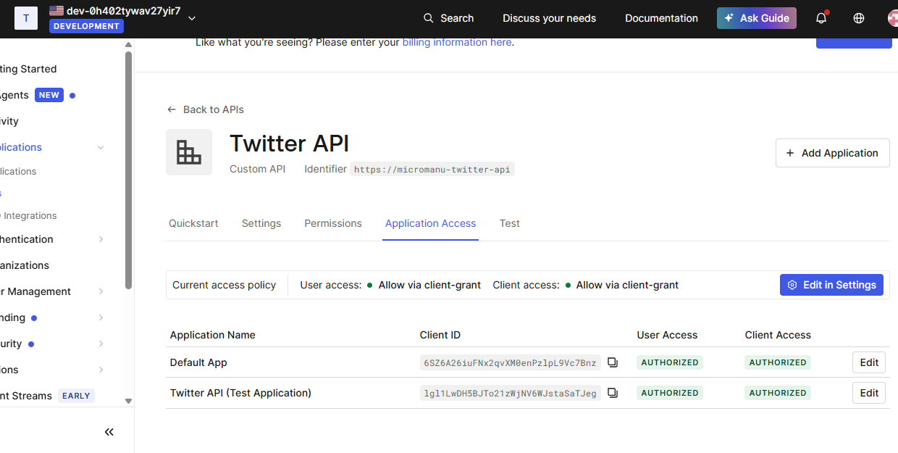
- 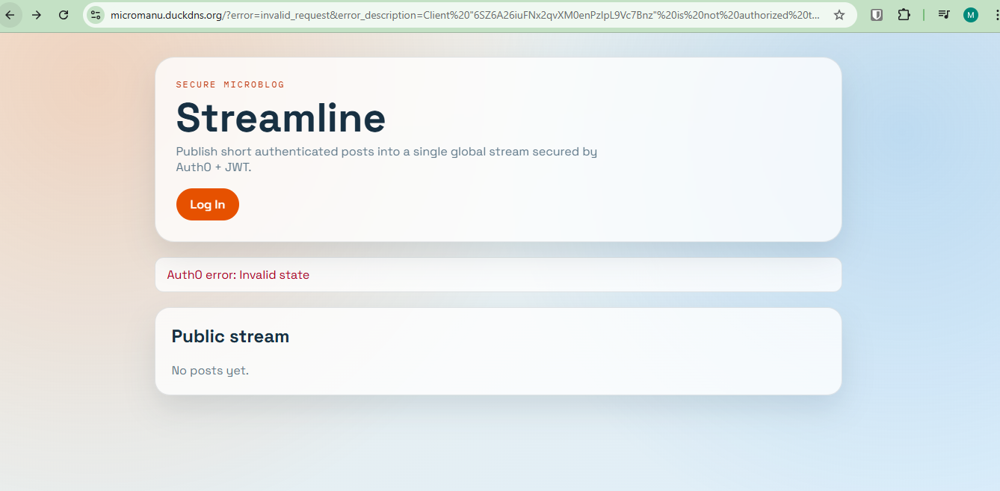

- Now we prove creating two users and loging with them
- 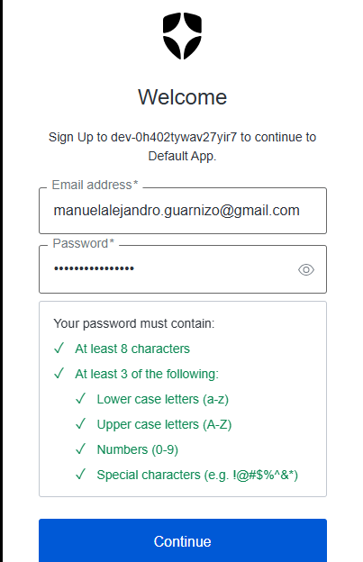
- We verify if it rejects the wrong password
- 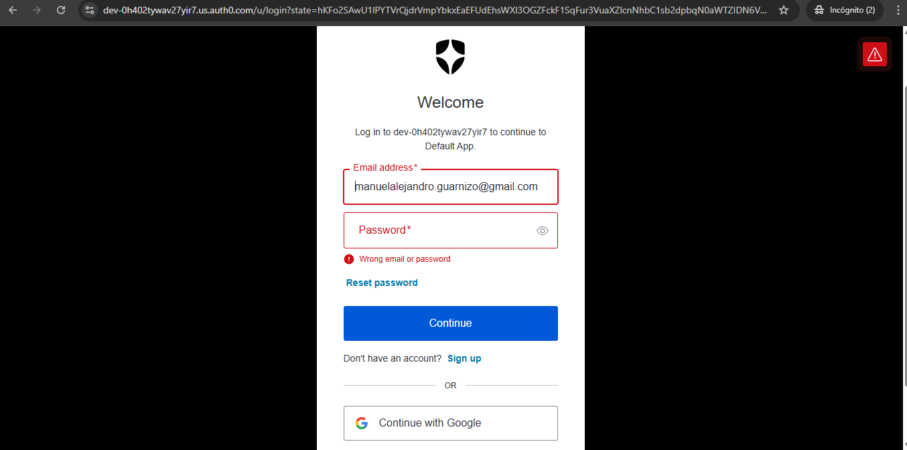
- Now we login to prove and its everything right
- 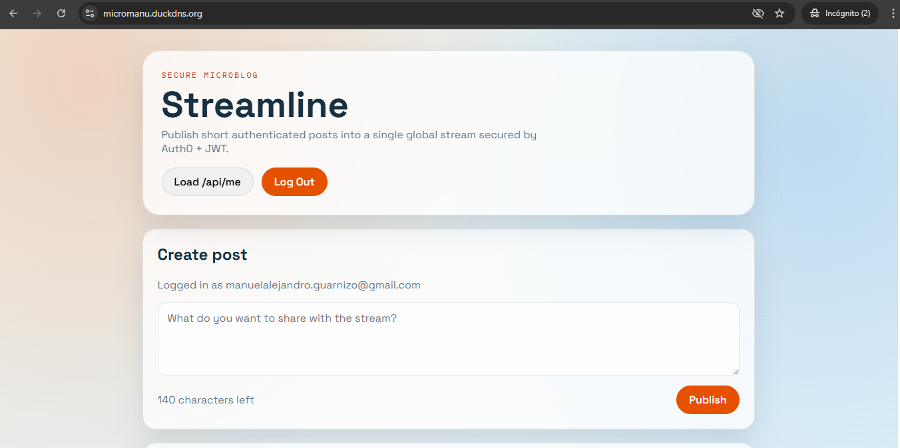
- And at the end we prove the google login with other user
- 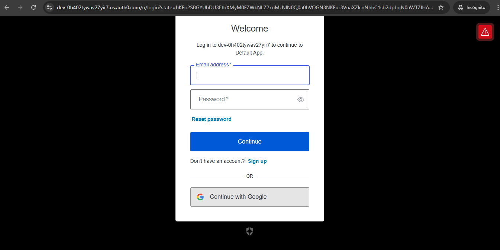
- 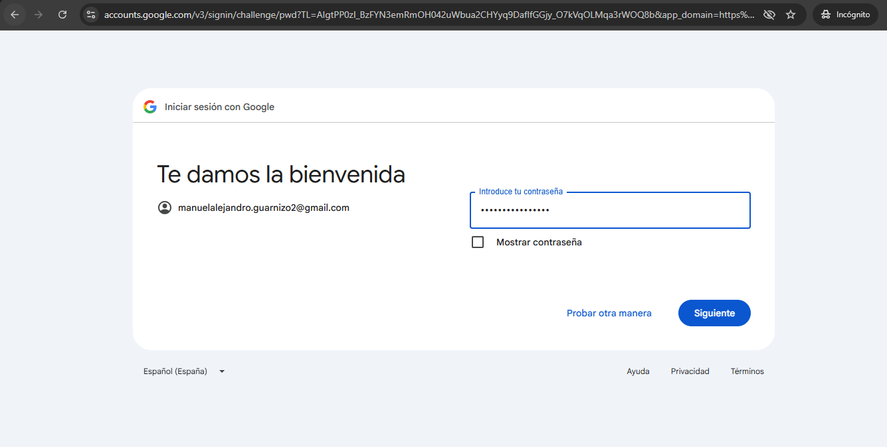
- And it's working right
- 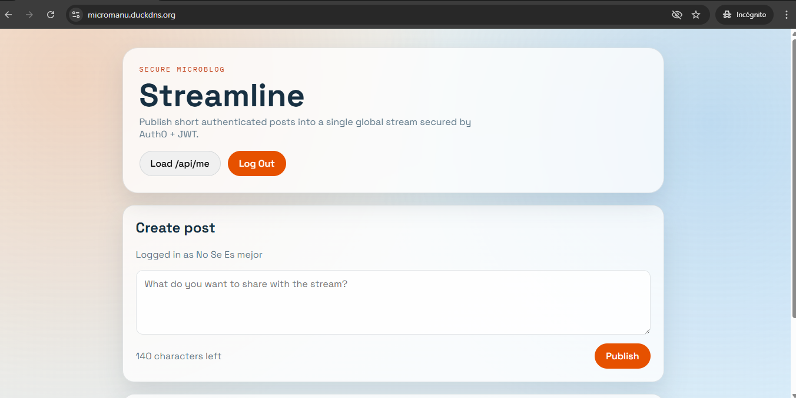


```bash
cd microservices
npm install
sam build
sam deploy --guided
```

Provide parameters when prompted:

- `Auth0IssuerUri`
- `Auth0Audience`
- `CorsAllowOrigin` (your S3 or CloudFront frontend URL)

After deployment, update frontend API base URL:

```dotenv
VITE_API_BASE_URL=https://YOUR_API_ID.execute-api.YOUR_REGION.amazonaws.com
```


## Testing Report

## Automated Tests Executed

Run all backend tests:

```bash
mvn test
```

Current suite validates:

- Post domain/service constraints (blank/too long post rejection).
- Public access to `GET /api/posts`.
- Unauthorized access rejection for protected endpoints.
- Scope-based authorization for `POST /api/posts` and `GET /api/me`.
- Successful protected access with valid JWT authorities.

## Manual End-to-End Tests Performed

- User can log in from frontend through Auth0.
- Authenticated user can publish a post <= 140 chars.
- Public stream updates and remains visible without login.
- `/api/me` profile data is returned only with valid token and required scope.
- Logout clears authenticated actions from UI.

## Security Considerations

- Do not commit credentials, client secrets, or API keys.
- Use environment variables for Auth0 and deployment configuration.
- Use AWS Secrets Manager / Parameter Store for production secrets.
- Enforce HTTPS in production for frontend and API endpoints.
- Keep scope checks strict on all write or profile endpoints.

